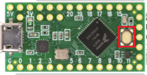
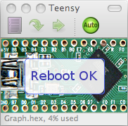
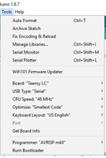
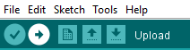

# Using the Teensy LC microcontroller

## Uploading pre-built firmware

You need to upload pre-built firmwares for a few hacks. 

1. Open the Teensy loader application (pinned to taskbar or *C:\Program Files (x86)\Arduino\hardware\tools\teensy.exe*)
2. Click: *File -> Open HEX File*
3. Select the file you want to flash.
4. Press the bootloader button on the microcontroller:

5. Wait for a "reboot ok" message on the Teensy loader:

## Building and Uploading firmware

1. Launch the Arduino application from the windows search bar:

2. Open the *.ino* file of the project you want to code from (*file->open*).

3. Make sure you have the following settings (select the serial port on which your microcontroller is connected):  

4. Open the Teensy loader application (*C:\Program Files (x86)\Arduino\hardware\tools\teensy.exe*)

5. *Ctrl+U* or click the upload button:  
  

6. Arduino will automatically transfer the generated hex file to the Teensy loader.  

7. Press the bootloader button on the microcontroller:
   
  

8. Wait for a "reboot ok" message on the Teensy loader:

## Documentation

The */Datasheets/TeensyLC.pdf* file contains the microcontroller's pinout.

Use the PJRC Arduino documentation for the following functions:

- Digital I/O (use digitalWriteFast and digitalReadFast): https://www.pjrc.com/teensy/td_digital.html
- PWM: https://www.pjrc.com/teensy/td_pulse.html 
- Timing Functions: https://www.pjrc.com/teensy/td_timing.html
- USB Serial: https://www.pjrc.com/teensy/td_serial.html

For other functions, refer to the original Arduino documentation:  
https://www.arduino.cc/reference/en/

