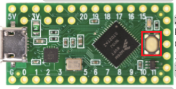
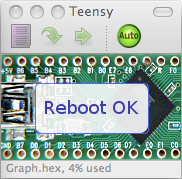
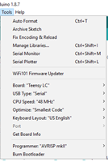

# Utiliser le microcontrôleur Teensy LC

## Téléverser un firmware pré-compilé

1. Ouvrir l'appication Teensy loader (épinglé à la barre de tâches ou *C:\Program Files (x86)\Arduino\hardware\tools\teensy.exe*)
2. Cliquez: *File -> Open HEX File*
3. Sélectionnez le fichier qu vous voulez flasher.
4. Appuyez sur le bouton du bootloader du microcontrôleur:

5. Attendez un message "reboot ok" sur l'interface:

## Compiler et téléverser un firmware

1. Lancer arduino:

2. Ouvrir le fichier *.ino* de votre projet (*file->open*).

3. Assurez-vous d'avoir les paramètres suivants (en sélectionnant le bon port sériel):  

4. Ouvrir l'appication Teensy loader (épinglé à la barre de tâches ou *C:\Program Files (x86)\Arduino\hardware\tools\teensy.exe*)

5. *Ctrl+U* ou cliquez sur le bouton "upload":  
  

6. Arduino va automatiquement transférer le fichier hex généré vers le Teensy loader. 

7. Appuyez sur le bouton du bootloader du microcontrôleur:

8. Attendez un message "reboot ok" sur l'interface:

## Documentation

Le fichier */Datasheets/TeensyLC.pdf* contient le brochage (pinout) du microcontrôleur.

Utilisez la documentation Arduino de PJRC pour les fonctionnalités suivantes:

- I/O Digital (utilisez digitalWriteFast and digitalReadFast): https://www.pjrc.com/teensy/td_digital.html
- PWM: https://www.pjrc.com/teensy/td_pulse.html 
- Timing Functions: https://www.pjrc.com/teensy/td_timing.html
- USB Serial: https://www.pjrc.com/teensy/td_serial.html

Pour les autres fonctions, référez-vous à la documentation Arduino oroginale:  
https://www.arduino.cc/reference/en/

