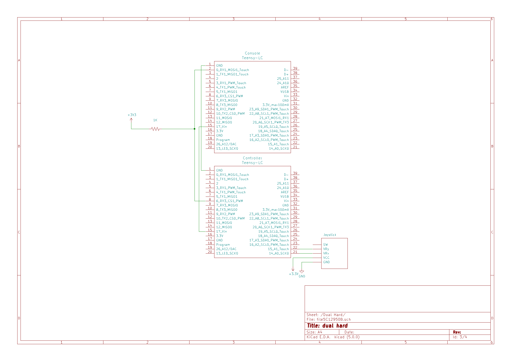

# Hardware Hacking

## Synopsis

The Council's idea of reuniting the universe-ities has left you feeling perplexed. What a ludicrous plan! Even if you wanted to, you couldn't possibly make peace with the other universe-ities. So, as any self righteous nerdy militant hardware hackers would do, we will take matters into our own hands! 

What do I propose, you ask?

It's simple. We blow up the CS Paradise.

However, nobody can know that you were responsible for their downfall. So your attacks must be subtle. You somehow manage to get onboard the ship and enter the control room. This is where the fun begins. You can't simply plant foreign objects in the ship. They would notice right away. You must use their own tools against them! Discretely alter the control methods of the dashboard, exploit hardware trojans, corrupt computing nodes. Your modifications must go unnoticed or your plan will fail.

## The Competition

### Scoring 

This competition is divided in 6 hacks. Each hack yields a certain number of points according to its difficulty. You can do the hacks in any order you want. There are no dependencies between them. Every time you finish a hack, signal to an evaluator who will grant you your points if it has been executed correctly. There are no half grades. You either completed the hack to 100% or failed to do so. The team with the most points after 3 hours wins the competition.

Please keep your wiring clean as evaluators will have to verify your circuits. Breadboard spaghetti will not be evaluated and you will be asked to redo your wiring. 

### Available tools 

Your workstations are comprised of the following hardware tools:

- Multimeter
- Logic analyzer

Your hardware kit includes the following:

- 2 x Teensy LC microcontroller
- 1 x LM339
- Resistors
- Capacitors
- Wires
- 2-axis analog joysticks
- Tactile switches
- Micro-usb cable

The following software is available on your Windows 10 virtual machine (all pinned to the taskbar):

- Arduino 
- Teensy loader
- Saleae Logic 1.2.18
- joy.cpl for gamepad testing
- Sublime text
- Git Bash

### Notes

**The microcontroller's pins operate at 3.3V and are NOT 5V tolerant. Inputing 5V will fry it and might damage peripherals.**

On the first connection of the microcontroller and the logic analyzer, you may have to manually connect usb devices to the VM. Click: VM->Removable Devices->Lakeview USB Device->Connect and VM->Removable Devices->Van Ooijen Technische Informatica->Connect. The USB device connection status should be the first thing you check if you are having problems flashing the microcontroller or seeing it in the testing software.

The VM's password is "Passw0rd!".

On the section set-up schematics, make sure to look at the pin names and not the KiCad block pin numbers for the microcontroller's pinout.

The */firmwares/* folder contains pre-built firmware needed for each section. 

The */Datasheets/* folder contains useful datasheets and directions on how to program the Teensy LC microcontroller. 

*.ino* files are provided for the hacks that require coding. They contain useful utilitary functions.  

Some hacks require button inputs. You do not need to debounce them.

The breadboard's power rails are split in the middle. Connect both halves with a jumper to get continuous power rails.

If you're having trouble during set-up, ask for help. You won't be penalized. We don't want you to waste any time setting up the hacks and making the software work.

## Section 1

The first component you examine is the main control system. It is comprised of a 2-axis joystick and a 4-button directional pad plugged into a computing node. The joystick controls the ship's engine and the d-pad allows the ship to select a parallel universe to navigate to. An evil idea sprouts to mind: what if you inverted these controls? The ship is bound to crash eventually if the captain tries to control it in this altered state. 

N.B. : This section contains 4 hacks because there are multiple ways to achieve its components. The first step of controls inversion is to control the directional pad with a joystick, which is implemented in hacks 1 and 2. The second step is controlling the joystick with a directional pad, which is implemented in hacks 3 and 4.

### Setup

For this section, a microcontroller acts as the control system's computing module. It's connected by USB to the host computer and acts as a USB gamepad. 

Set-up the circuit according to this schematic (INCLUDING THE PHYSICAL LAYOUT OF THE BUTTONS). VCC for the joystick is 3.3V, ignore the fact that the pin is labeled as 5V :

Then, plug the microcontroller into your computer's USB port and flash it with the *section1.hex* firmware. To test its inputs, use the *joy.cpl* application. Search for this file in the windows search bar and double click the gamepad device to see the testing page. If you do not see the device, double check the VM usb device settings. The 4 d-pad switches should trigger the 4 hat directions in the testing software. The joystick should trigger analog stick positions in both directions.

### Hack 1 (5 points)

Control the directional pad inputs with a joystick. D-pad directions should be triggered when the joystick goes beyond half of its maximum electrical range in a given direction. You may not alter the firmware on the computing node. Your solution must be an addition of external components.

Hardware you must use (you are not allowed to use anything else):  
    - Joystick   
    - A second Teensy LC microcontroller, which you can program as you wish.  
    - Wires  

### Hack 2 (10 points)

Control the directional pad inputs with a joystick. D-pad directions should be triggered when the joystick goes beyond half of its maximum electrical range in a given direction. You may not alter the firmware on the computing node. Your solution must be an addition of external components.

Hardware you must use (you are not allowed to use anything else):  
    - LM339 analog comparator (datasheet: /Datasheets/lm339.pdf)  
    - Resistors (as many as you need)  
    - Wires  

### Hack 3 (5 points)

Control the joystick inputs with a directional pad. The 4 d-pad switches must imitate the behavior of the joystick when it is moved halfway along their respective directions (ex: the UP switch makes the joystick go halfway of its maximum range in the NORTH direction on the gamepad testing software). The implementation must allow combinations of X and Y inputs (ex: pressing up and right at the same time make the joystick go halfway of its maximum range in the NORTH-EAST direction). You may not alter the firmware on the computing node. Your solution must be an addition of external components.

Hardware you must use (you are not allowed to use anything else):  
    - 4 tactile switches  
    - Resistors (as many as you need)  
    - Wires

N.B:  
- When the X and Y axis input pins are left floating, the gamepad registers a neutral position.  

### Hack 4 (10 points)

Control the joystick inputs with a directional pad. The 4 d-pad switches must imitate the behavior of the joystick when it is moved halfway along their respective directions (ex: the UP switch makes the joystick go halfway of its maximum range in the NORTH direction). The implementation must allow combinations of X and Y inputs (ex: pressing up and right at the same time make the joystick go halfway of its maximum range in the NORTH-EAST direction). You may not alter the firmware on the computing node. Your solution must be an addition of external components.

Hardware you must use (you are not allowed to use anything else):  
    - A second Teensy LC microcontroller  
    - Resistors (as many as you need)  
    - Capacitors (as many as you need)  
    - Wires

N.B: When the X and Y axis input pins are left floating, the gamepad registers a neutral position.

## Section 2

After altering the pilot's dashboard in section 1, you decide to examine the weapon systems. You see 8 buttons labeled: UP, RIGHT, DOWN, LEFT, TORPEDO, CANON, SHIELD, SELFDESTRUCT. This is a perfect opportunity. You could map the SHIELD button to the SELFDESTRUCT function, so the Council gets a little surprise the next time they want to raise their shields. :hear_no_evil: :bomb: :skull: :smiling_imp:

 You do not have access to the button wires. However, you manage to expose part of the internals. You see that the buttons are used as inputs into a microcontroller, which in turn is connected to the main system with 3 unidentified wires. Coincidentally, you have access to the input controller's USB port and the USB bootloader has been left intact (such horrible design). This leaves the system open for a textbook Corrupted Node attack! 

### Setup

In this section, there are two microcontrollers. One acts as an input controller and the other acts as the main system. The input controller grabs all the system's inputs and transmits them to the main system via an unknown communication protocol. 

Set-up the circuit according to this schematic (INCLUDING THE PHYSICAL LAYOUT OF THE BUTTONS):

Then, plug the input controller into your computer's USB port and flash it with the *section2_input_controller.hex* firmware. Unplug the input controller, plug the main system microcontroller into your computer's USB port and flash it with the *section2_main_system.hex* firmware. Head into your gamepad tester. The 4 d-pad switches should trigger the 4 hat directions in the testing software. The other 4 buttons should have the following mappings:

- TORPEDO: button 0
- CANON: button 1
- SHIELD: button 2
- SELF DESTRUCT: button 3

### Hack 5 (20 points)

Your job is to alter the functioning of the input controller so that the SHIELD and SELF DESTRUCT functions are switched. The behavior of the other buttons must remain unchanged. As mentioned above, you cannot change the electronic circuit. The only way to implement the attack is to alter the input controller's firmware. You do not have access to the firmware's source code, so you have to reverse-engineer and re-implement the communication protocol between the input controller and the main systems to implement this hack. 

Here is a sample of the signals you should acquire with the logic analyzer:

## Section 3

In the two previous sections, you hacked the ship's dashboard and weapons control. In theory, your job is done here. However, on your way out of the ship, you happen to pass by the captain's lounge. As you enter, you find his gaming system plugged into a TV. It's running *Animal Crossing*... :cow: :pig: :dog: 

This doesn't seem to be a standard console. The only input in the controller is a joystick, there are no buttons, and the controller is connected with only one data wire. 

 A brilliant idea then comes to mind. You know what would make the captain really mad? Making his controller misbehave :joy_cat: . So, you decide to introduce some intermittent dysfunctionalities by hacking his controller.

### Setup

In this section, there are two microcontrollers. One acts as a game controller and the other acts as the console. The controller reads joystick inputs and transmits them to the console via an unknown communication protocol. 

Set-up the circuit according to this schematic. VCC for the joystick is 3.3V, ignore the fact that the pin is labeled as 5V :

Then, plug the console microcontroller into your computer's USB port and flash it with the *section3_console.hex* firmware. Unplug the console microcontroller, connect the controller microcontroller and flash it with the *section3_controller.hex* firmware. Unplug the controller microcontroller, connect the console microcontroller, and head into your gamepad tester of choice. Moving the controller's joystick should trigger analog stick positions in both directions.

### Hack 6 (40 points)

As mentioned above, you cannot change the electronic circuit. The only way to implement the attack is to alter the controller's firmware. You do not have access to the firmware's source code, so you have to reverse-engineer and re-implement the communication protocol between the controller and the console to implement this hack.

There are 3 dysfunctionalities you must implement:

- For 5 seconds, the controller acts normally.
- For 5 seconds, the X axis and Y axis are inverted (X is perceived as Y and vice-versa).
- For 5 seconds, the controller only sends neutral joystick positions.

Loop through them indefinitely in 15 second cycles.

Here is a sample of the signals you should acquire with the logic analyzer:

N.B. : Since this is a software implementation of a fast hardware protocol, timing errors may happen. As a countermeasure, a watchdog timer has been implemented in the console's firmware. The usb device will restart if the console gets hung up during communications. It is also a good indicator of the timing accuracy of your implementation.

