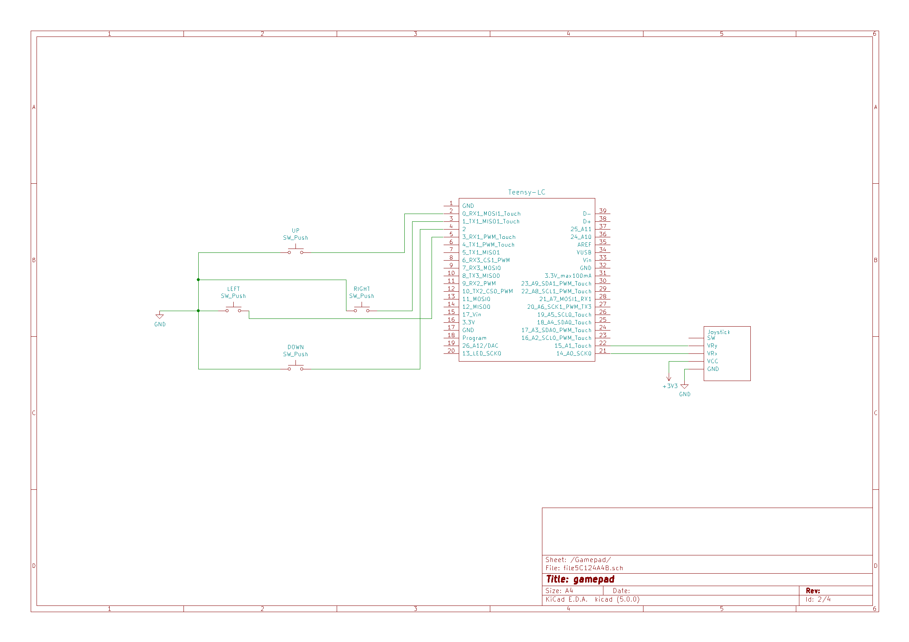
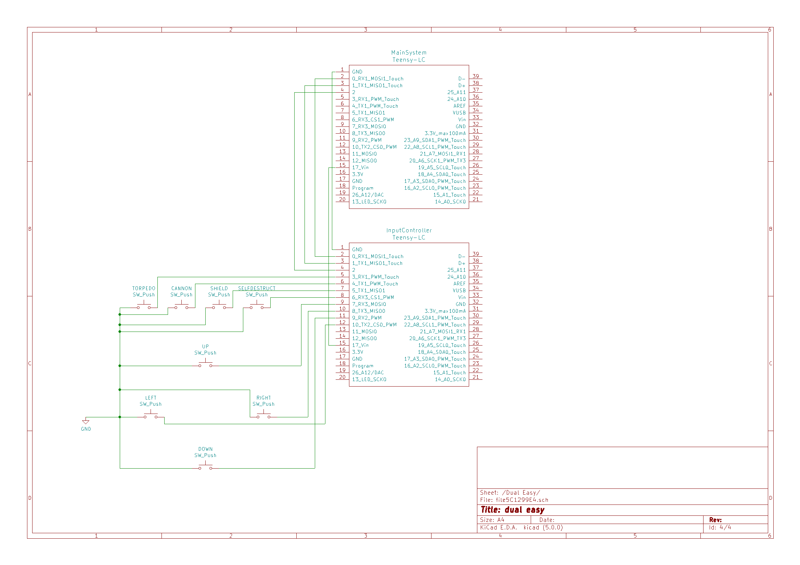
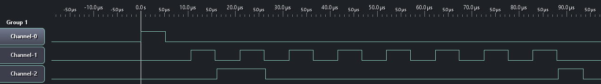
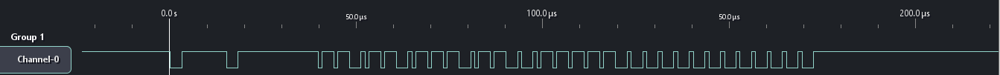

# Hardware Hacking

## Synopsis

Le désir du consulat de réunir les unvers-ités vous laisse perplexe. Quelle idée ridicule! Vous ne pourriez jamais faire la paix avec vos ennemis. Donc, comme tout hardware hacker militant ferait, vous vous occuperez de la situation!

Qu'est-ce que je propose?

C'est simple. On fait sauter le CS Paradise.

Cependant, personne ne peut savoir que vous êtes responsable de l'incident. Vos attaques devront être subtiles. Vous arrivez à vous faufiler dans le vaisseau et atteignez la salle de contrôles. C'est ici que votre mandat commence. Vous ne pouvez pas simplement implanter des objets externes. Ils se feraient remarquer immédiatement. Vous devez donc utiliser les outils du consulat contre eux! Altérez discrètement les méthodes de contrôle, exploitez des hardware trojans, corrompez des noeuds de de calcul. Vos modifications doivent passer inaperçues ou votre plan échouera.

## La compétition

### Scores 

La compétition est divisée en 6 hacks distribués sur 3 sections. Chaque hack vaut un certain nombre de points dépendamment de sa difficulté. Vous pouvez faire les hacks dans l'ordre que vous voulez car il n'y a pas de dépendances entre elles. 

Quand vous terminez un hack, signalez à un évaluateur. Il viendra vérifier votre implémentation et vous accordera vos points si elle est correcte. Il n'y a pas de demi-notes. Vous avez complété le hack à 100% ou c'est un échec. L'équipe avec le plus de points après 3h gagne la compétition.

SVP garder vos circuits propres car les évaluateurs auront à les vérifier. Le spaghetti sur breadboard ne sera pas accepté et vous devrez refaire le circuit. 

### Outils disponibles 

Vos stations de travail incluent les outils suivants:

- Multimètre
- Analyseur logique

Vos hardware kits contiennent les composantes suivantes:

- 2 x Teensy LC microcontrôleur 
- 1 x LM339
- Resistors
- Capacitors
- Wires
- 2-axis analog joysticks
- Tactile switches
- Micro-usb cable

Les logiciels suivants sont installés sur votre machine virtuelle Windows 10 (tous épinglés sur la barre de tâche):

- Arduino 
- Teensy loader
- Saleae Logic 1.2.18
- joy.cpl
- Sublime text
- Git Bash

### Notes
**Les pins du microcontrôleur opèrent à 3.3V et ne supportent PAS un signal à 5V. Il sera grillé si connecté à un signal de 5V.**

Lors de la première connexion du microcontrôleur et de l'analyseur logique, vous devrez manuellement connecter les dispositifs USB. VM->Removable Devices->Lakeview USB Device->Connect et VM->Removable Devices->Van Ooijen Technische Informatica->Connect. Si vous avez des problèmes à flasher le microcontrôleur ou à le voir dans le logiciel de test, vérifiez son statut de connexion à la VM.

Le mot de passe de la VM est "Passw0rd!".

Sur les schémas de configuration des sections, faites attention d'utiliser les étiquettes textuelles des pins du microcontrôleur et non les numéros de signaux sortant du bloc KiCad.

Le dossier */firmwares/* contient les firmware précompilés pour chaque section.

Le dossier */Datasheets/* contient des documents techniques et des instructions sur comment programmer le microcontrôleur. 

Des fichiers *.ino* de base sont fournis pour les hacks qui requièrent de la programmation. Ils contiennent des fonctions utiles.

Les joysticks fournis ont un intervalle anormal. Leur intervalle électrique se termine à environs 50% de leur intervalle physique. Quand on parle de bouger d'un certain pourcentage le long d'une axe du joystick, on parle de son intervalle électrique et non physique.  

Certains hacks demandent des entrées de boutons tactiles. Vous n'avez pas besoin de faire un anti-rebond (debounce).

Les rails d'alimentation sur le breadboard sont discontinus au centre. Connectez les deux moitiés pour avoir un rail continu.

Si vous avez des problèmes lors du set-up d'une section, demandez de l'aide. Ne perdez pas votre temps sur la configuration SVP.

## Section 1

La première composante que vous examinez est le système de contrôle principal. Il est composé d'un joystick 2 axes et d'une croix directionnelle de 4 boutons. Le joystick contrôle les moteurs du vaisseau et la croix permet de sélectionner un univers parallèle à naviguer. Une idée vous vient à l'esprit: vous pourriez inverser leurs fonctions. Le vaisseau est voué à s'écraser si le capitaine essaie de le contrôler dans cet état altéré.

N.B. : Cette section contient 4 hacks car il y a plusieurs façons d'implémenter ses composantes. Les contrôle de la croix directionnelle avec le joystick se fait dans les hacks 1 et 2. Le contrôle du joystick avec la croix directionnelle se fait dans les hacks 3 et 4.

### Configuration

Dans cette section, un microcontrôleur agit en tant que module principal du système de contrôle. Il est connecté au PC par USB et transfère ses données en tant que manette de jeu USB.

Implémentez le circuit suivant (INCLUANT LA DISPOSITION DES BOUTONS). Le VCC du joystick est bien 3.3V, ignorez le fait que la pin est étiquetée 5V:

Branchez le microcontrôleur dans le port usb de votre PC et flashez le avec le firmware *section1.hex*. Pour tester le système, vous utiliserez l'application *joy.cpl*. Cherchez ce fichier dans la barre de recherche Windows et double cliquez sur le dispositif USB pour ouvrir la page de test. Les 4 boutons de la croix directionnelle devraient déclencher le "hat" dans leurs directions respectives. Le joystick devrait déplacer les axes analogues dans les deux directions.

### Hack 1 (5 points)

Contrôlez les entrées de la croix directionnelle avec un joystick. Les directions de la croix devraient être déclenchées lorsque le joystick dépasse la moitié du seuil d'activation maximal dans une direction donnée. Vous ne pouvez pas altérer le firmware du système principal; votre solution doit être une addition de composantes externes.

Composantes que vous devez utiliser (vous n'avez pas le droit d'ajouter autre chose):  
    - Joystick  
    - Un deuxième microcontrôleur  
    - Fils  

### Hack 2 (10 points)

Contrôlez les entrées de la croix directionnelle avec un joystick. Les directions de la croix devraient être déclenchées lorsque le joystick dépasse la moitié du seuil d'activation maximal dans une direction donnée. Vous ne pouvez pas altérer le firmware du système principal; votre solution doit être une addition de composantes externes.

Composantes que vous devez utiliser (vous n'avez pas le droit d'ajouter autre chose):  
    - Comparateur analogue LM339 (datasheet: /Datasheets/lm339.pdf)  
    - Résistances  
    - Fils  

### Hack 3 (5 points)

Contrôlez les entrées du joystick avec une croix directionnelle. Les 4 boutons tactiles doivent imiter le comportement du joystick lorsqu'il se trouve à 50% de son seuil d'activation maximal (ex: le bouton UP déclenche un mouvement de 50% en direction NORD dans le logiciel de test). Votre implémentation doit permettre la combinaison de direction verticales et horizontales (ex: UP et DROITE en même temps déclenchent un mouvement de 50% direction NORD-EST). Vous ne pouvez pas altérer le firmware du système principal; votre solution doit être une addition de composantes externes.

Composantes que vous devez utiliser (vous n'avez pas le droit d'ajouter autre chose):  
    - 4 interrupteurs tactiles  
    - Résistances  
    - Fils  

N.B:  
- Lorsque les pins d'entrée des axes X et Y sont flottantes, le gamepad affiche une position neutre. 

### Hack 4 (10 points)

Contrôlez les entrées du joystick avec une croix directionnelle. Les 4 boutons tactiles doivent imiter le comportement du joystick lorsqu'il se trouve à 50% de son seuil d'activation maximal (ex: le bouton UP déclenche un mouvement de 50% en direction NORD dans le logiciel de test). Votre implémentation doit permettre la combinaison de direction verticales et horizontales (ex: UP et DROITE en même temps déclenchent un mouvement de 50% direction NORD-EST). Vous ne pouvez pas altérer le firmware du système principal; votre solution doit être une addition de composantes externes.

Composantes que vous devez utiliser (vous n'avez pas le droit d'ajouter autre chose):  
    - Un autre microcontrôleur  
    - Résistances  
    - Condensateurs  
    - Fils  

N.B:  
- Lorsque les pins d'entrée des axes X et Y sont flottantes, le gamepad affiche une position neutre. 

## Section 2

Une fois le système de contrôle altéré, vous décidez d'examiner les système d'armes. Vous notez 8 boutons étiquetés: UP, RIGHT, DOWN, LEFT, TORPEDO, CANON, SHIELD, SELFDESTRUCT. C'est une opportunité parfaite. Vous pourriez associer le bouton SHIELD à la fonction SELFDESTRUCT... le consulat aura une petite surprise la prochaine fois que le capitaine essaie d'armer ses boucliers. :hear_no_evil: :bomb: :skull: :smiling_imp: 

Vous n'avez pas accès aux fils des boutons poussoirs. Cependant, vous êtes capables d'exposer une partie des circuits. Vous observez que les boutons sont entrés dans un microcontrôleur et que celui-ci est connecté au système principal avec trois lignes de données non-identifiées. Vous remarquez que vous avez également accès au port usb du microcontrôleur gérant les boutons et que le bootloader USB a été laissé intact (quel design horrible). Cela laisse le système ouvert pour une attaque classique de corruption de noeud!

### Configuration

Dans cette section, il y a deux microcontrôleurs. Un est le gestionnaire d'entrées et l'autre est le système principal. Le gestionnaire d'entrée lit les boutons et les transmet au système principal via un protocole inconnu. 

Implémentez le circuit suivant (INCLUANT LA DISPOSITION DES BOUTONS):

Branchez le gestionnaire d'entrées dans votre PC et flashez le avec le firmware *section2_input_controller.hex*. Débranchez le gestionnaire d'entrées, connectez le système principal et flashez le avec le firmware *section2_main_system.hex*. Ouvrez le testeur de gamepad. Les 4 boutons de la croix directionnelle devraient déclencher le "hat" et les 4 boutons devraient avoir les correspondances suivantes:

- TORPEDO: button 0
- CANON: button 1
- SHIELD: button 2
- SELF DESTRUCT: button 3

### Hack 5 (20 points)

Vous devez altérer le fonctionnement du gestionnaire d'entrées pour que les fonction SHIELD et SElFDESTRUCT soient inversées. Le comportement des autres boutons reste inchangé. Comme mentionné précédemment, vous ne pouvez pas altérer les circuits électriques. La seule façon de l'implémenter est de changer le firmware du gestionnaire d'entrées. Vous n'avez pas accès à son code source donc vous devez étudier le protocole de communication et le réimplémenter. 

Voici un exemple de signaux que vous devriez observer avec l'analyseur logique:

## Section 3

Dans les deux sections précédentes, vous avez hacké le dashboard et les contrôles d'armes. En théorie, votre travail est terminé. Cependant, en sortant du vaisseau, vous passez par la chambre du capitaine. En entrant, vous remarquez qu'il possède un système de jeu branché dans une TV. La console roule *Animal Crossing*... :cow: :pig: :dog: 

Cette console ne semble pas standard. La seule entrée de la manette est un joystick; il n'y a pas de boutons. La manette est connectée à la console avec un seul fil de données.

Une idée brillante vous vient à l'esprit. Vous savez ce qui rendrait le capitaine furieux? Briser sa manette :joy_cat: . Vous décidez donc d'introduire des dysfonctionnalités en hackant sa manette.

### Configuration

Dans cette section, il y a deux microcontrôleurs. Une agit comme la manette et l'autre comme la console. La manette lit les entrées du joystick et les transmet à la console via un protocole inconnu. 

Implémentez le circuit suivant. Le VCC du joystick est bien 3.3V, ignorez le fait que la pin est étiquetée 5V:

Branchez le microcontrôleur de la console dans le port usb du PC et flashez le avec le firmware *section3_console.hex*. Connectez le microcontrôleur de la console et flashez le avec le firmware *section3_controller.hex*. Reconnectez le microcontrôleur de la console et ouvrez le testeur de gamepad sur votre PC. Le joystick devrait déplacer les axes analogues dans les deux directions.

### Hack 6 (40 points)

Comme mentionné précédemment, vous ne pouvez pas altérer les circuits électriques. La seule façon de l'implémenter est de changer le firmware de la manette. Vous n'avez pas accès à son code source donc vous devez étudier le protocole de communication et le réimplémenter. 

Voici les 3 dysfonctionnalités à implémenter:

- Pendant 2 secondes, la manette agit normalement.
- Pendant 2 secondes, les axes X et Y sont inversés (X perçu comme y et vice-versa). 
- Pendant 2 secondes, la manette n'envoit que des positions de joystick neutres.

Itérez à travers ces 3 modes infiniment dans des cycles de 6 secondes. 

Voici un exemple de signaux que vous devriez observer avec l'analyseur logique:

N.B. : Ceci est une implémentation logicielle d'un protocole de communication matériel rapide. Donc des erreurs de timing peuvent arriver facilement. En contre-mesure, un watchdog a été implémenté dans le firmware de la console. Le dispositif se réinitialise s'il y a blocage lors des communications. C'est également un bon indicateur de l'exactitude temporelle de votre implémentation du protocole. 

